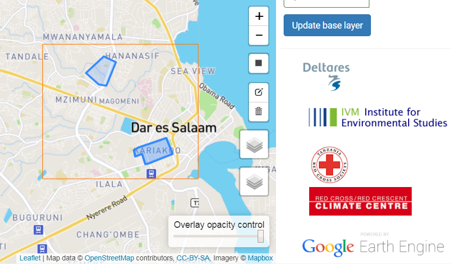

# PARTERRA web application (OSM-terrain)

This application allows you to fuse together data from OpenStreetMap (OSM) and the Shuttle Radar Topography Mission (SRTM) to create a high-resolution digital terrain model for any area in the world. The combination leads to very high resolution terrain in well-mapped urban areas.

It currently runs at http://osm-terrain.appspot.com/

The tool requires the following steps:  
  * Upload a downloaded OSM dataset to 2 fusion tables (polygons and lines). Fusion table is a Google Drive format for a GIS vector layer, this should be done outside this tool.
  * Start: Fill out the IDs of the fusion tables and your geographical project settings (domain and resolution).
  * Filters: Filter features (Buildings, Roads or waterways) within a polygon or within a valid tag range, and assign default terrain-related properties to them.
  * Export data: visualize the resulting terrain layers, based upon the filters and assigned terrain related properties.

## Setup

Required python libraries (in root folder):
- ee
- httplib2
- oauth2client

Required javascript libraries (in static/lib):
- bootstrap
- bootstrap-notify
- bootstrap-validator
- codeflask
- geojsonhint
- leaflet
- leaflet.draw
- prism

Placeholders for private keys and tokens need to be filled in:
- in setup.js the access tokens for Mapbox
- in config.py `EE_ACCOUNT` and `EE_PRIVATE_KEY_FILE`
- the actual `EE_PRIVATE_KEY_FILE` is not uploaded to this repository
